# Modelo de dominio — Al Toro Gastrobar

El dominio del sistema Al Toro Gastrobar está organizado en ocho módulos funcionales. Todas las entidades principales extienden `AuditableEntity`, que provee los campos de auditoría `createdAt` y `updatedAt` gestionados automáticamente por Spring Data JPA. El esquema de base de datos es `restaurante`.

---

# Tabla de contenidos

- [Diagrama de clases](#diagrama-de-clases)
- [Módulo auth](#módulo-auth)
- [Módulo usuarios](#módulo-usuarios)
- [Módulo reservas](#módulo-reservas)
- [Módulo mesas y comandas](#módulo-mesas-y-comandas)
- [Módulo producción e inventario](#módulo-producción-e-inventario)
- [Módulo pagos y caja](#módulo-pagos-y-caja)
- [Módulo notificaciones](#módulo-notificaciones)
- [Entidad base](#entidad-base)
- [Enumeraciones del dominio](#enumeraciones-del-dominio)

---

## Diagrama de clases

```mermaid
classDiagram
    direction TB

    class AuditableEntity {
        +LocalDateTime createdAt
        +LocalDateTime updatedAt
    }

    %% AUTH
    class Usuario {
        +Long usuarioId
        +String usuarioEmail
        +String usuarioPassword
    }
    class Sesion {
        +Long sesionId
        +String sesionToken
        +String sesionRefreshToken
        +LocalDateTime sesionFechaCreacion
        +Boolean sesionActiva
    }

    %% USUARIOS
    class Cliente {
        +Long usuarioId (PK=FK)
        +String clienteNombre
        +String clienteTelefono
        +String clienteDireccion
        +LocalDate clienteFechaNacimiento
        +Integer clientePuntos
        +Integer clientePuntosAcumulados
        +Boolean clienteAceptaTerminos
        +LocalDateTime clienteFechaAceptacion
    }
    class Empleado {
        +Long usuarioId (PK=FK)
        +String empleadoNombre
        +String empleadoDireccion
        +String empleadoTelefono
        +LocalDate empleadoFechaIngreso
    }
    class UsuarioRol {
        +Long usuarioId (PK)
        +RolNombre rolNombre (PK)
        +RolEstado rolEstado
    }
    class CanjePuntos {
        +Long canjeId
        +Integer canjePuntosCanjeados
        +LocalDateTime canjeFechaHora
    }

    %% RESERVAS
    class Reserva {
        +Long reservaId
        +LocalDateTime reservaFechaHoraLlegada
        +Integer reservaNumeroPersonas
        +String reservaNotas
        +EstadoReserva reservaEstado
        +TipoReserva reservaTipo
        +LocalDateTime reservaFechaCreacion
    }
    class Decoracion {
        +Long decoracionId
        +String decoracionNombre
        +EstadoGenerico decoracionEstado
        +BigDecimal decoracionCostoAdicional
        +String decoracionImagenUrl
    }
    class DecoracionZona {
        +Long decoracionId (PK)
        +Long zonaId (PK)
        +LocalDateTime createdAt
    }
    class BloqueDisponibilidad {
        +Long bloqueId
        +LocalDate fechaInicio
        +LocalDate fechaFin
        +LocalTime horaInicio
        +LocalTime horaFin
        +String motivo
    }

    %% MESAS Y COMANDAS
    class Zona {
        +Long zonaId
        +String zonaNombre
        +Integer zonaCapacidadPersonas
        +String zonaImagenUrl
    }
    class Visita {
        +Long visitaId
        +LocalDateTime visitaFechaHoraInicio
        +LocalDateTime visitaFechaHoraFin
    }
    class Mesa {
        +Long visitaId (PK=FK)
        +String mesaIdentificador
        +Integer mesaNumeroPersonas
        +EstadoMesa mesaEstado
        +String mesaNotas
    }
    class Comanda {
        +Long comandaId
        +EstacionComanda comandaEstacion
        +LocalDateTime comandaFechaHoraInicio
        +LocalDateTime comandaFechaHoraListo
        +String comandaNotas
        +EstadoComanda comandaEstado
    }
    class ComandaItem {
        +Long comandaItemId
        +Integer comandaItemCantidad
        +BigDecimal comandaItemPrecio
        +String comandaItemDescripcion
        +String comandaItemMenuGrupo
    }
    class ComandaMenuModificacion {
        +Long id
        +LocalDateTime createdAt
    }

    %% INVENTARIO
    class CategoriaCarta {
        +Integer categoriacartaId
        +String categoriaNombre
        +Integer orden
        +Boolean activo
    }
    class Producto {
        +Long productoId
        +String productoNombre
        +EstadoGenerico productoEstado
        +BigDecimal productoPrecio
        +TipoProducto productoTipo
        +CategoriaProducto productoCategoria
        +String productoDescripcion
        +Boolean menuEspecial
        +BigDecimal stockActual
    }
    class Insumo {
        +Long insumoId
        +String insumoNombre
        +UnidadMedida insumoUnidad
        +BigDecimal insumoStockActual
        +EstadoGenerico insumoEstado
        +TipoInsumo tipoInsumo
    }
    class Receta {
        +Long insumoId (PK)
        +Long productoId (PK)
        +BigDecimal recetaCantidad
    }
    class OpcionModificacion {
        +Long opcionId
        +TipoComponenteMenu tipoComponente
        +String opcionNombre
        +EstadoGenerico opcionEstado
    }
    class ProductoOpcionModificacion {
        +Producto producto (PK)
        +OpcionModificacion opcion (PK)
        +LocalDateTime createdAt
    }
    class MenuBebidaDisponible {
        +Long productoMenuId (PK)
        +Long productoBebidaId (PK)
        +LocalDateTime createdAt
    }
    class MovimientoInventario {
        +Long movimientoId
        +BigDecimal movimientoCantidad
        +TipoMovimiento movimientoTipo
        +String movimientoProveedor
        +String movimientoNumeroFactura
        +String movimientoObservaciones
        +LocalDateTime movimientoFechaHora
    }

    %% PAGOS
    class Venta {
        +Long visitaId (PK=FK)
        +LocalDateTime ventaFechaHora
        +BigDecimal ventaSubtotal
        +BigDecimal ventaDescuento
        +BigDecimal ventaTotal
        +MetodoPago ventaMetodo
    }
    class Abono {
        +Long abonoId
        +BigDecimal abonoMonto
        +LocalDateTime abonoFechaHora
        +MetodoPago abonoMetodo
        +TipoAbono abonoTipo
    }

    %% NOTIFICACIONES
    class Notificacion {
        +Long notificacionId
        +EstadoNotificacion notificacionEstado
        +TipoNotificacion notificacionTipo
        +LocalDateTime notificacionFechaHora
    }

    %% Relaciones
    AuditableEntity <|-- Usuario
    AuditableEntity <|-- Cliente
    AuditableEntity <|-- Empleado
    AuditableEntity <|-- UsuarioRol
    AuditableEntity <|-- Reserva
    AuditableEntity <|-- Decoracion
    AuditableEntity <|-- BloqueDisponibilidad
    AuditableEntity <|-- Zona
    AuditableEntity <|-- Mesa
    AuditableEntity <|-- Comanda
    AuditableEntity <|-- CategoriaCarta
    AuditableEntity <|-- Producto
    AuditableEntity <|-- Insumo
    AuditableEntity <|-- Receta
    AuditableEntity <|-- OpcionModificacion

    Usuario "1" --> "0..*" Sesion
    Usuario "1" -- "0..1" Cliente : MapsId
    Usuario "1" -- "0..1" Empleado : MapsId
    Usuario "1" --> "0..*" UsuarioRol

    Cliente "1" --> "0..*" Reserva
    Cliente "1" --> "0..*" Visita
    Cliente "1" --> "0..*" CanjePuntos

    Empleado "1" --> "0..*" CanjePuntos
    Empleado "1" --> "0..*" BloqueDisponibilidad
    Empleado "1" --> "0..*" MovimientoInventario
    Empleado "1" --> "0..*" Mesa : mesero
    Empleado "1" --> "0..*" Venta : cajero
    Empleado "1" --> "0..*" Abono : cajero
    Empleado "0..1" --> "0..*" Notificacion

    Zona "1" --> "0..*" Mesa
    Zona "1" --> "0..*" Reserva
    Zona "1" --> "0..*" DecoracionZona

    Decoracion "1" --> "0..*" DecoracionZona
    Decoracion "0..1" --> "0..*" Reserva

    Reserva "0..1" --> "0..1" Visita
    Reserva "1" --> "0..*" Abono
    Reserva "0..1" --> "0..*" Comanda : pre-reserva

    Visita "1" -- "0..1" Mesa : MapsId
    Visita "1" -- "0..1" Venta : MapsId
    Visita "1" --> "0..*" Comanda

    Comanda "1" --> "0..*" ComandaItem
    Comanda "0..1" --> "0..*" Notificacion

    ComandaItem "1" --> "0..*" ComandaMenuModificacion
    ComandaItem "0..*" --> "1" Producto

    Mesa "1" --> "0..*" Notificacion

    CategoriaCarta "1" --> "0..*" Producto
    Producto "1" --> "0..*" Receta
    Producto "1" --> "0..*" ProductoOpcionModificacion
    Producto "1" --> "0..*" MenuBebidaDisponible : menu
    Producto "1" --> "0..*" MenuBebidaDisponible : bebida
    Producto "0..1" --> "0..*" MovimientoInventario

    Insumo "1" --> "0..*" Receta
    Insumo "0..1" --> "0..*" MovimientoInventario

    OpcionModificacion "1" --> "0..*" ProductoOpcionModificacion
    OpcionModificacion "1" --> "0..*" ComandaMenuModificacion
```



---

## Módulo auth

### `Usuario`

Entidad de autenticación base para todos los usuarios del sistema. Almacena únicamente las credenciales de acceso (email + contraseña hasheada en BCrypt). Los datos de perfil específicos residen en `Cliente` y `Empleado`, vinculados mediante `@OneToOne` con `@MapsId`.

| Campo | Tipo | Restricciones |
|-------|------|---------------|
| `usuarioId` | `Long` | PK, generado por BD |
| `usuarioEmail` | `String` | Unique, not null, max 150 chars, formato email |
| `usuarioPassword` | `String` | Not null, max 255 chars, BCrypt |

| Relación | Cardinalidad | Entidad destino | Notas |
|----------|-------------|-----------------|-------|
| Sesiones | `1:N` | `Sesion` | Via FK `usuario_id` en `sesion` |
| Perfil cliente | `1:0..1` | `Cliente` | `@MapsId` — PK compartida |
| Perfil empleado | `1:0..1` | `Empleado` | `@MapsId` — PK compartida |
| Roles | `1:N` | `UsuarioRol` | Via FK `usuario_id` en `usuario_rol` |

---

### `Sesion`

Registro de una sesión activa del usuario. Cada fila representa un par de tokens (access + refresh) emitidos. El filtro JWT consulta esta tabla para verificar que el token recibido corresponda a una sesión activa, implementando revocación sin listas negras externas. No extiende `AuditableEntity`.

| Campo | Tipo | Restricciones |
|-------|------|---------------|
| `sesionId` | `Long` | PK, generado por BD |
| `sesionToken` | `String` | Unique, not null, max 1024 chars — access JWT |
| `sesionRefreshToken` | `String` | Unique, not null, max 1024 chars — refresh JWT |
| `sesionFechaCreacion` | `LocalDateTime` | Not null, defecto: ahora |
| `sesionActiva` | `Boolean` | Not null, defecto: `true` |

| Relación | Cardinalidad | Entidad destino | Notas |
|----------|-------------|-----------------|-------|
| Usuario propietario | `N:1` | `Usuario` | FK `usuario_id`, LAZY |

---

## Módulo usuarios

### `Cliente`

Perfil extendido de un cliente registrado. Comparte PK con `Usuario` vía `@MapsId`. Gestiona el programa de fidelización mediante dos contadores de puntos: `clientePuntos` (canjeable, se resetea) y `clientePuntosAcumulados` (lifetime, solo crece).

| Campo | Tipo | Restricciones |
|-------|------|---------------|
| `usuarioId` | `Long` | PK = FK a `usuario` |
| `clienteNombre` | `String` | Not null, max 100 chars |
| `clienteTelefono` | `String` | Not null, 10 dígitos, formato colombiano |
| `clienteDireccion` | `String` | Nullable, max 255 chars |
| `clienteFechaNacimiento` | `LocalDate` | Nullable |
| `clientePuntos` | `Integer` | Not null, min 0, defecto 0 — saldo canjeable |
| `clientePuntosAcumulados` | `Integer` | Not null, min 0, defecto 0 — contador lifetime |
| `clienteAceptaTerminos` | `Boolean` | Not null |
| `clienteFechaAceptacion` | `LocalDateTime` | Not null |

| Relación | Cardinalidad | Entidad destino | Notas |
|----------|-------------|-----------------|-------|
| Credenciales | `N:1` | `Usuario` | `@MapsId`, LAZY |
| Reservas | `1:N` | `Reserva` | Via FK `cliente_id` |
| Visitas | `1:N` | `Visita` | Via FK `cliente_id` |
| Canjes | `1:N` | `CanjePuntos` | Via FK `cliente_id` |

---

### `Empleado`

Perfil extendido de un empleado. Comparte PK con `Usuario` vía `@MapsId`. El rol operativo (mesero, cajero, cocinero, etc.) se determina por los registros activos en `UsuarioRol`, no por un campo en esta entidad.

| Campo | Tipo | Restricciones |
|-------|------|---------------|
| `usuarioId` | `Long` | PK = FK a `usuario` |
| `empleadoNombre` | `String` | Not null, max 100 chars |
| `empleadoDireccion` | `String` | Nullable, max 255 chars |
| `empleadoTelefono` | `String` | Not null, 10 dígitos, formato colombiano |
| `empleadoFechaIngreso` | `LocalDate` | Not null |

| Relación | Cardinalidad | Entidad destino | Notas |
|----------|-------------|-----------------|-------|
| Credenciales | `N:1` | `Usuario` | `@MapsId`, LAZY |
| Mesas asignadas | `1:N` | `Mesa` | Como mesero |
| Ventas procesadas | `1:N` | `Venta` | Como cajero |
| Abonos registrados | `1:N` | `Abono` | Como cajero |
| Movimientos inventario | `1:N` | `MovimientoInventario` | Responsable del movimiento |
| Canjes ejecutados | `1:N` | `CanjePuntos` | Empleado que canjea |
| Bloqueos creados | `1:N` | `BloqueDisponibilidad` | Solo rol ADMIN |

---

### `UsuarioRol`

Asignación de un rol funcional a un usuario. PK compuesta: `(usuarioId, rolNombre)`. Un usuario puede tener varios roles simultáneos; solo los roles con `rolEstado = ACTIVO` otorgan permisos.

| Campo | Tipo | Restricciones |
|-------|------|---------------|
| `usuarioId` | `Long` | PK (parte 1) |
| `rolNombre` | `RolNombre` | PK (parte 2), `@Enumerated(STRING)` |
| `rolEstado` | `RolEstado` | Not null, `@Enumerated(STRING)` |

| Relación | Cardinalidad | Entidad destino | Notas |
|----------|-------------|-----------------|-------|
| Usuario | `N:1` | `Usuario` | FK `usuario_id`, insertable=false |

---

### `CanjePuntos`

Registro de auditoría de canjes del programa de fidelización. La tabla crece solo con inserts; nunca se actualiza ni elimina. No extiende `AuditableEntity`.

| Campo | Tipo | Restricciones |
|-------|------|---------------|
| `canjeId` | `Long` | PK, generado por BD |
| `canjePuntosCanjeados` | `Integer` | Not null, min 1 |
| `canjeFechaHora` | `LocalDateTime` | Not null, defecto: ahora |

| Relación | Cardinalidad | Entidad destino | Notas |
|----------|-------------|-----------------|-------|
| Cliente | `N:1` | `Cliente` | FK `cliente_id`, not null |
| Empleado ejecutor | `N:1` | `Empleado` | FK `empleado_id`, not null |

---

## Módulo reservas

### `Reserva`

Entidad principal que representa una solicitud de ocupación futura. Gestiona el ciclo de vida desde la creación hasta la atención o cancelación. Los ítems de pre-orden se persisten como una `Comanda` en estado `PRE_RESERVA`.

| Campo | Tipo | Restricciones |
|-------|------|---------------|
| `reservaId` | `Long` | PK, generado por BD |
| `reservaFechaHoraLlegada` | `LocalDateTime` | Not null — fecha futura al crear |
| `reservaNumeroPersonas` | `Integer` | Not null, min 1 |
| `reservaNotas` | `String` | Nullable, TEXT |
| `reservaEstado` | `EstadoReserva` | Not null, `@Enumerated(STRING)` |
| `reservaTipo` | `TipoReserva` | Not null, `@Enumerated(STRING)` |
| `reservaFechaCreacion` | `LocalDateTime` | Not null, asignado en `@PrePersist` |

| Relación | Cardinalidad | Entidad destino | Notas |
|----------|-------------|-----------------|-------|
| Cliente | `N:1` | `Cliente` | FK `cliente_id`, not null |
| Zona | `N:1` | `Zona` | FK `zona_id`, nullable |
| Decoración | `N:1` | `Decoracion` | FK `decoracion_id`, nullable |
| Abonos | `1:N` | `Abono` | Via FK `reserva_id` |
| Pre-comanda | `1:0..1` | `Comanda` | Estado `PRE_RESERVA`, Via FK `reserva_id` |
| Visita | `1:0..1` | `Visita` | Via FK `reserva_id` — cuando el cliente llega |

**Flujo de estados:** `PENDIENTE → CONFIRMADA → ATENDIDA | CANCELADA | DEVUELTA | INASISTENCIA`

---

### `Decoracion`

Servicio opcional seleccionable al crear una reserva. `decoracionCostoAdicional = null` equivale a sin costo; un valor positivo convierte la reserva en `ESPECIAL` y exige pago de anticipo.

| Campo | Tipo | Restricciones |
|-------|------|---------------|
| `decoracionId` | `Long` | PK, generado por BD |
| `decoracionNombre` | `String` | Not null, max 100 chars |
| `decoracionEstado` | `EstadoGenerico` | Not null, `@Enumerated(STRING)` |
| `decoracionCostoAdicional` | `BigDecimal` | Nullable, min 1.00, precision(12,2) |
| `decoracionImagenUrl` | `String` | Nullable, max 500 chars |

| Relación | Cardinalidad | Entidad destino | Notas |
|----------|-------------|-----------------|-------|
| Zonas disponibles | `1:N` | `DecoracionZona` | Via FK `decoracion_id` |

---

### `DecoracionZona`

Tabla de unión M:N entre `Decoracion` y `Zona`. Indica en qué zonas puede ofrecerse cada decoración. PK compuesta: `(decoracionId, zonaId)`. No extiende `AuditableEntity`.

| Campo | Tipo | Restricciones |
|-------|------|---------------|
| `decoracionId` | `Long` | PK (parte 1) |
| `zonaId` | `Long` | PK (parte 2) |
| `createdAt` | `LocalDateTime` | Not null, asignado en `@PrePersist` |

| Relación | Cardinalidad | Entidad destino | Notas |
|----------|-------------|-----------------|-------|
| Decoración | `N:1` | `Decoracion` | FK `decoracion_id`, insertable=false |
| Zona | `N:1` | `Zona` | FK `zona_id`, insertable=false |

---

### `BloqueDisponibilidad`

Bloqueo de franja horaria o día completo creado por un administrador para impedir nuevas reservas en ese rango. `horaInicio` y `horaFin = null` indica bloqueo de día completo.

| Campo | Tipo | Restricciones |
|-------|------|---------------|
| `bloqueId` | `Long` | PK, generado por BD |
| `fechaInicio` | `LocalDate` | Not null |
| `fechaFin` | `LocalDate` | Not null, >= `fechaInicio` |
| `horaInicio` | `LocalTime` | Nullable |
| `horaFin` | `LocalTime` | Nullable — exclusiva |
| `motivo` | `String` | Nullable, max 255 chars |

| Relación | Cardinalidad | Entidad destino | Notas |
|----------|-------------|-----------------|-------|
| Administrador | `N:1` | `Empleado` | FK `admin_id`, not null, solo rol ADMIN |

---

## Módulo mesas y comandas

### `Zona`

Área física del restaurante donde se ubican las mesas. `zonaCapacidadPersonas` es informativa; la ocupación real se calcula sumando comensales de las mesas activas en esa zona.

| Campo | Tipo | Restricciones |
|-------|------|---------------|
| `zonaId` | `Long` | PK, generado por BD |
| `zonaNombre` | `String` | Not null, max 100 chars |
| `zonaCapacidadPersonas` | `Integer` | Not null, min 1 |
| `zonaImagenUrl` | `String` | Nullable, max 500 chars |

| Relación | Cardinalidad | Entidad destino | Notas |
|----------|-------------|-----------------|-------|
| Decoraciones | `1:N` | `DecoracionZona` | Via FK `zona_id` |
| Reservas | `1:N` | `Reserva` | Via FK `zona_id` |
| Mesas activas | `1:N` | `Mesa` | Via FK `zona_id` |

---

### `Visita`

Estancia activa de comensales desde que se sientan hasta que cierran la cuenta. Actúa como raíz de agregado para `Mesa`, `Comanda` y `Venta`. `visitaFechaHoraFin = null` indica visita activa. Existen dos orígenes: con reserva previa y walk-in. No extiende `AuditableEntity`.

| Campo | Tipo | Restricciones |
|-------|------|---------------|
| `visitaId` | `Long` | PK, generado por BD |
| `visitaFechaHoraInicio` | `LocalDateTime` | Not null, defecto: ahora |
| `visitaFechaHoraFin` | `LocalDateTime` | Nullable — null mientras la visita es activa |

| Relación | Cardinalidad | Entidad destino | Notas |
|----------|-------------|-----------------|-------|
| Cliente | `N:1` | `Cliente` | FK `cliente_id`, nullable (walk-in anónimo) |
| Reserva de origen | `N:1` | `Reserva` | FK `reserva_id`, nullable (walk-in) |
| Mesa | `1:0..1` | `Mesa` | `@MapsId` — PK compartida |
| Venta | `1:0..1` | `Venta` | `@MapsId` — PK compartida |
| Comandas | `1:N` | `Comanda` | Via FK `visita_id` |

---

### `Mesa`

Asignación de una mesa física para una visita concreta. Comparte PK con `Visita` vía `@MapsId`. El estado refleja la disponibilidad en tiempo real para el host de recepción.

| Campo | Tipo | Restricciones |
|-------|------|---------------|
| `visitaId` | `Long` | PK = FK a `visita` |
| `mesaIdentificador` | `String` | Not null, max 20 chars (ej. "T-04") |
| `mesaNumeroPersonas` | `Integer` | Not null, min 1 |
| `mesaEstado` | `EstadoMesa` | Not null, `@Enumerated(STRING)` |
| `mesaNotas` | `String` | Nullable, TEXT |

| Relación | Cardinalidad | Entidad destino | Notas |
|----------|-------------|-----------------|-------|
| Visita | `N:1` | `Visita` | `@MapsId`, LAZY |
| Zona | `N:1` | `Zona` | FK `zona_id`, not null |
| Mesero | `N:1` | `Empleado` | FK `mesero_id`, not null |
| Notificaciones | `1:N` | `Notificacion` | Via FK `mesa_id` |

**Flujo de estados:** `ESPERA → EN_PREPARACION → ATENDIDA → CERRADA`

---

### `Comanda`

Orden de producción asociada a una visita en curso o a una reserva con pre-orden. En estado `PRE_RESERVA`, `visita` y `comandaEstacion` son `null`; se asignan al convertir la pre-comanda al iniciar la visita. Las comandas se enrutan a una única estación: `COCINA` o `BARRA`.

| Campo | Tipo | Restricciones |
|-------|------|---------------|
| `comandaId` | `Long` | PK, generado por BD |
| `comandaEstacion` | `EstacionComanda` | Not null en visita activa; null en `PRE_RESERVA` |
| `comandaFechaHoraInicio` | `LocalDateTime` | Nullable — asignado al transicionar a `PENDIENTE` |
| `comandaFechaHoraListo` | `LocalDateTime` | Nullable — asignado al transicionar a `LISTO` |
| `comandaNotas` | `String` | Nullable, TEXT |
| `comandaEstado` | `EstadoComanda` | Not null, `@Enumerated(STRING)` |

| Relación | Cardinalidad | Entidad destino | Notas |
|----------|-------------|-----------------|-------|
| Visita | `N:1` | `Visita` | FK `visita_id`, nullable en `PRE_RESERVA` |
| Reserva origen | `N:1` | `Reserva` | FK `reserva_id`, nullable (walk-in) |
| Ítems | `1:N` | `ComandaItem` | Cascade ALL, via FK `comanda_id` |

**Flujo de estados:** `PRE_RESERVA → BORRADOR → PENDIENTE → EN_PREPARACION → LISTO → COMPLETADO`

---

### `ComandaItem`

Línea de producto dentro de una comanda. El precio se captura al momento del pedido y no varía si el catálogo se actualiza. El campo `comandaItemMenuGrupo` (UUID) agrupa los ítems COCINA+BARRA de un mismo menú especial; es null para ítems de carta. No extiende `AuditableEntity`.

| Campo | Tipo | Restricciones |
|-------|------|---------------|
| `comandaItemId` | `Long` | PK, generado por BD |
| `comandaItemCantidad` | `Integer` | Not null, min 1 |
| `comandaItemPrecio` | `BigDecimal` | Not null, min 0.00, precision(12,2) |
| `comandaItemDescripcion` | `String` | Nullable, max 500 chars — notas del cliente |
| `comandaItemMenuGrupo` | `String` | Nullable, max 36 chars — UUID de agrupación menú especial |
| `createdAt` | `LocalDateTime` | Not null, defecto: ahora |

| Relación | Cardinalidad | Entidad destino | Notas |
|----------|-------------|-----------------|-------|
| Comanda | `N:1` | `Comanda` | FK `comanda_id`, not null |
| Producto | `N:1` | `Producto` | FK `producto_id`, not null |
| Modificaciones | `1:N` | `ComandaMenuModificacion` | Cascade ALL, orphanRemoval=true |

---

### `ComandaMenuModificacion`

Opción de personalización de menú especial seleccionada para un ítem. Solo existe para ítems de menú especial; cada fila vincula un `ComandaItem` con una `OpcionModificacion` válida para ese producto. No extiende `AuditableEntity`.

| Campo | Tipo | Restricciones |
|-------|------|---------------|
| `id` | `Long` | PK, generado por BD |
| `createdAt` | `LocalDateTime` | Not null, defecto: ahora |

| Relación | Cardinalidad | Entidad destino | Notas |
|----------|-------------|-----------------|-------|
| Ítem de comanda | `N:1` | `ComandaItem` | FK `comanda_item_id`, not null |
| Opción seleccionada | `N:1` | `OpcionModificacion` | FK `opcion_id`, not null |

---

## Módulo producción e inventario

### `CategoriaCarta`

Agrupa los productos de la carta bajo un nombre común. El campo `orden` determina la posición de visualización; `activo = false` oculta la categoría sin eliminarla.

| Campo | Tipo | Restricciones |
|-------|------|---------------|
| `categoriacartaId` | `Integer` | PK, generado por BD |
| `categoriaNombre` | `String` | Unique, not null, max 100 chars |
| `orden` | `Integer` | Not null, defecto 0 |
| `activo` | `Boolean` | Not null, defecto `true` |

| Relación | Cardinalidad | Entidad destino | Notas |
|----------|-------------|-----------------|-------|
| Productos | `1:N` | `Producto` | Via FK `categoriacarta_id` |

---

### `Producto`

Artículo del catálogo del restaurante. Cuando `menuEspecial = true`, el producto forma parte de los menús especiales para grupos y expone opciones de modificación. `stockActual` aplica solo a productos de `VENTA_DIRECTA`; los de `PREPARACION` gestionan stock a nivel de insumos.

| Campo | Tipo | Restricciones |
|-------|------|---------------|
| `productoId` | `Long` | PK, generado por BD |
| `productoNombre` | `String` | Not null, max 100 chars |
| `productoEstado` | `EstadoGenerico` | Not null, `@Enumerated(STRING)` |
| `productoPrecio` | `BigDecimal` | Not null, min 0.00, precision(12,2) |
| `productoTipo` | `TipoProducto` | Not null, `@Enumerated(STRING)` |
| `productoCategoria` | `CategoriaProducto` | Not null, `@Enumerated(STRING)` |
| `productoDescripcion` | `String` | Nullable, max 500 chars |
| `menuEspecial` | `Boolean` | Nullable — null equivale a false |
| `stockActual` | `BigDecimal` | Nullable, min 0.000, precision(12,3) |

| Relación | Cardinalidad | Entidad destino | Notas |
|----------|-------------|-----------------|-------|
| Categoría carta | `N:1` | `CategoriaCarta` | FK `categoriacarta_id`, not null |
| Receta | `1:N` | `Receta` | Via FK `producto_id` |
| Opciones de modificación | `1:N` | `ProductoOpcionModificacion` | Via FK `producto_id` |
| Bebidas de menú especial | `1:N` | `MenuBebidaDisponible` | Como menu o como bebida |
| Movimientos inventario | `1:N` | `MovimientoInventario` | Via FK `producto_id` |

---

### `Insumo`

Ingrediente o preparación intermedia. Se clasifica como `MATERIA_PRIMA` (comprado directamente) o `SEMIELABORADO` (elaborado en batch). El stock se gestiona mediante `MovimientoInventario`.

| Campo | Tipo | Restricciones |
|-------|------|---------------|
| `insumoId` | `Long` | PK, generado por BD |
| `insumoNombre` | `String` | Not null, max 100 chars |
| `insumoUnidad` | `UnidadMedida` | Not null, `@Enumerated(STRING)` |
| `insumoStockActual` | `BigDecimal` | Not null, min 0.000, defecto 0, precision(12,3) |
| `insumoEstado` | `EstadoGenerico` | Not null, `@Enumerated(STRING)` |
| `tipoInsumo` | `TipoInsumo` | Not null, defecto `MATERIA_PRIMA` |

| Relación | Cardinalidad | Entidad destino | Notas |
|----------|-------------|-----------------|-------|
| Recetas | `1:N` | `Receta` | Via FK `insumo_id` |
| Movimientos inventario | `1:N` | `MovimientoInventario` | Via FK `insumo_id` |

---

### `Receta`

Relación insumo-producto con la cantidad requerida. PK compuesta `(insumoId, productoId)` modelada con `@IdClass`. Define qué insumos y en qué cantidad componen un producto de tipo `PREPARACION`.

| Campo | Tipo | Restricciones |
|-------|------|---------------|
| `insumoId` | `Long` | PK (parte 1) |
| `productoId` | `Long` | PK (parte 2) |
| `recetaCantidad` | `BigDecimal` | Not null, min 0.001, precision(12,3) |

| Relación | Cardinalidad | Entidad destino | Notas |
|----------|-------------|-----------------|-------|
| Insumo | `N:1` | `Insumo` | FK `insumo_id`, insertable=false |
| Producto | `N:1` | `Producto` | FK `producto_id`, insertable=false |

---

### `OpcionModificacion`

Opción de componente seleccionable en un menú especial. Las opciones se agrupan por `tipoComponente` para mostrar controles de selección en el formulario de pre-orden.

| Campo | Tipo | Restricciones |
|-------|------|---------------|
| `opcionId` | `Long` | PK, generado por BD |
| `tipoComponente` | `TipoComponenteMenu` | Not null, `@Enumerated(STRING)` |
| `opcionNombre` | `String` | Not null, max 150 chars |
| `opcionEstado` | `EstadoGenerico` | Not null, defecto `ACTIVO` |

| Relación | Cardinalidad | Entidad destino | Notas |
|----------|-------------|-----------------|-------|
| Productos que la incluyen | `1:N` | `ProductoOpcionModificacion` | Via FK `opcion_id` |

---

### `ProductoOpcionModificacion`

Tabla de unión M:N entre `Producto` y `OpcionModificacion`. Define qué opciones de modificación están disponibles para cada menú especial. PK compuesta por las FKs. No extiende `AuditableEntity`.

| Campo | Tipo | Restricciones |
|-------|------|---------------|
| `producto` | `Producto` | PK (parte 1), FK `producto_id` |
| `opcion` | `OpcionModificacion` | PK (parte 2), FK `opcion_id` |
| `createdAt` | `LocalDateTime` | Not null, asignado en `@PrePersist` |

---

### `MenuBebidaDisponible`

Asociación M:N entre un producto de tipo menú especial y las bebidas que puede llevar. PK embebida `(productoMenuId, productoBebidaId)` con `@EmbeddedId`. No extiende `AuditableEntity`.

| Campo | Tipo | Restricciones |
|-------|------|---------------|
| `id.productoMenuId` | `Long` | PK (parte 1) — FK al producto menú |
| `id.productoBebidaId` | `Long` | PK (parte 2) — FK al producto bebida |
| `createdAt` | `LocalDateTime` | Not null, asignado en `@PrePersist` |

| Relación | Cardinalidad | Entidad destino | Notas |
|----------|-------------|-----------------|-------|
| Menú especial | `N:1` | `Producto` | `@MapsId("productoMenuId")` |
| Bebida disponible | `N:1` | `Producto` | `@MapsId("productoBebidaId")` |

---

### `MovimientoInventario`

Registro inmutable de un ingreso o egreso en inventario. Cada movimiento afecta exactamente a un `Producto` o a un `Insumo`, nunca a ambos. Los campos `movimientoProveedor` y `movimientoNumeroFactura` aplican solo a ingresos por compra. No extiende `AuditableEntity`.

| Campo | Tipo | Restricciones |
|-------|------|---------------|
| `movimientoId` | `Long` | PK, generado por BD |
| `movimientoCantidad` | `BigDecimal` | Not null, min 0.001, precision(12,3) |
| `movimientoTipo` | `TipoMovimiento` | Not null, `@Enumerated(STRING)` |
| `movimientoProveedor` | `String` | Nullable, max 150 chars |
| `movimientoNumeroFactura` | `String` | Nullable, max 150 chars |
| `movimientoObservaciones` | `String` | Nullable, TEXT |
| `movimientoFechaHora` | `LocalDateTime` | Not null, defecto: ahora |

| Relación | Cardinalidad | Entidad destino | Notas |
|----------|-------------|-----------------|-------|
| Empleado responsable | `N:1` | `Empleado` | FK `empleado_id`, not null |
| Producto afectado | `N:1` | `Producto` | FK `producto_id`, nullable |
| Insumo afectado | `N:1` | `Insumo` | FK `insumo_id`, nullable |

---

## Módulo pagos y caja

### `Venta`

Registro de cierre de cuenta de una visita. Se crea exactamente una `Venta` por `Visita`. Comparte PK con `Visita` vía `@MapsId`. Al crear la venta, el servicio acumula +1 punto de fidelización al cliente y cierra la visita. No extiende `AuditableEntity`.

| Campo | Tipo | Restricciones |
|-------|------|---------------|
| `visitaId` | `Long` | PK = FK a `visita` |
| `ventaFechaHora` | `LocalDateTime` | Not null, defecto: ahora |
| `ventaSubtotal` | `BigDecimal` | Not null, min 0.00, precision(12,2) — suma de ítems |
| `ventaDescuento` | `BigDecimal` | Not null, min 0.00, defecto 0.00, precision(12,2) |
| `ventaTotal` | `BigDecimal` | Not null, min 0.00, precision(12,2) — subtotal − descuento |
| `ventaMetodo` | `MetodoPago` | Not null, `@Enumerated(STRING)` |

| Relación | Cardinalidad | Entidad destino | Notas |
|----------|-------------|-----------------|-------|
| Visita | `N:1` | `Visita` | `@MapsId`, LAZY |
| Cajero | `N:1` | `Empleado` | FK `cajero_id`, not null |

---

### `Abono`

Movimiento de dinero asociado a una reserva: anticipo del cliente o devolución. Una reserva puede tener múltiples abonos. El saldo ya pagado se calcula como suma de anticipos menos devoluciones. No extiende `AuditableEntity`.

| Campo | Tipo | Restricciones |
|-------|------|---------------|
| `abonoId` | `Long` | PK, generado por BD |
| `abonoMonto` | `BigDecimal` | Not null, min 0.01, precision(12,2) |
| `abonoFechaHora` | `LocalDateTime` | Not null, defecto: ahora |
| `abonoMetodo` | `MetodoPago` | Not null, `@Enumerated(STRING)` |
| `abonoTipo` | `TipoAbono` | Not null, `@Enumerated(STRING)` |

| Relación | Cardinalidad | Entidad destino | Notas |
|----------|-------------|-----------------|-------|
| Cajero | `N:1` | `Empleado` | FK `cajero_id`, not null |
| Reserva | `N:1` | `Reserva` | FK `reserva_id`, not null |

---

## Módulo notificaciones

### `Notificacion`

Alerta emitida a un empleado sobre el estado de una mesa. El campo `comanda` es obligatorio solo para tipos `PLATOS_LISTOS`, `BEBIDAS_LISTAS` y `CAMBIO`; es null para `ATENCION`. El campo `empleado` es null mientras la notificación está `ACTIVA` y se asigna al atenderla. No extiende `AuditableEntity`.

| Campo | Tipo | Restricciones |
|-------|------|---------------|
| `notificacionId` | `Long` | PK, generado por BD |
| `notificacionEstado` | `EstadoNotificacion` | Not null, `@Enumerated(STRING)` |
| `notificacionTipo` | `TipoNotificacion` | Not null, `@Enumerated(STRING)` |
| `notificacionFechaHora` | `LocalDateTime` | Not null, defecto: ahora |

| Relación | Cardinalidad | Entidad destino | Notas |
|----------|-------------|-----------------|-------|
| Mesa | `N:1` | `Mesa` | FK `mesa_id`, not null |
| Empleado que atiende | `N:1` | `Empleado` | FK `empleado_id`, nullable mientras `ACTIVA` |
| Comanda asociada | `N:1` | `Comanda` | FK `comanda_id`, nullable — solo tipos producción |

---

## Entidad base

### `AuditableEntity`

Clase abstracta `@MappedSuperclass` que provee auditoría automática mediante Spring Data JPA Auditing. Todas las entidades del dominio extienden esta clase, salvo `Sesion`, `Visita`, `CanjePuntos`, `ComandaItem`, `ComandaMenuModificacion`, `DecoracionZona`, `ProductoOpcionModificacion`, `MenuBebidaDisponible`, `MovimientoInventario`, `Venta`, `Abono` y `Notificacion`, que gestionan su propia columna `created_at` de forma independiente.

| Campo | Tipo | Restricciones |
|-------|------|---------------|
| `createdAt` | `LocalDateTime` | Not null, solo escritura en `@PrePersist` |
| `updatedAt` | `LocalDateTime` | Actualizado en cada `@PreUpdate` |

```java
@MappedSuperclass
@EntityListeners(AuditingEntityListener.class)
public abstract class AuditableEntity implements Serializable {
    @CreatedDate
    @Column(name = "created_at", nullable = false, updatable = false)
    private LocalDateTime createdAt;

    @LastModifiedDate
    @Column(name = "updated_at")
    private LocalDateTime updatedAt;
}
```

---

## Enumeraciones del dominio

Todas las enumeraciones residen en `co.edu.unicauca.backend.shared.enums` y se persisten como `STRING` en la base de datos.

| Enumeración | Valores | Entidad que la usa |
|-------------|---------|-------------------|
| `CategoriaProducto` | `PLATO`, `BEBIDA` | `Producto.productoCategoria` |
| `EstacionComanda` | `COCINA`, `BARRA` | `Comanda.comandaEstacion` |
| `EstadoComanda` | `PRE_RESERVA`, `BORRADOR`, `PENDIENTE`, `EN_PREPARACION`, `LISTO`, `COMPLETADO` | `Comanda.comandaEstado` |
| `EstadoGenerico` | `ACTIVO`, `INACTIVO` | `Producto.productoEstado`, `Insumo.insumoEstado`, `Decoracion.decoracionEstado`, `OpcionModificacion.opcionEstado` |
| `EstadoMesa` | `ESPERA`, `EN_PREPARACION`, `ATENDIDA`, `CERRADA` | `Mesa.mesaEstado` |
| `EstadoNotificacion` | `ACTIVA`, `ATENDIDA` | `Notificacion.notificacionEstado` |
| `EstadoReserva` | `PENDIENTE`, `CONFIRMADA`, `ATENDIDA`, `CANCELADA`, `DEVUELTA`, `INASISTENCIA` | `Reserva.reservaEstado` |
| `MetodoPago` | `EFECTIVO`, `NEQUI`, `TARJETA`, `TRANSFERENCIA`, `OTRO` | `Venta.ventaMetodo`, `Abono.abonoMetodo` |
| `RolEstado` | `ACTIVO`, `INACTIVO` | `UsuarioRol.rolEstado` |
| `RolNombre` | `CLIENTE`, `MESERO`, `CAJERO`, `COCINERO`, `BARTENDER`, `ADMIN` | `UsuarioRol.rolNombre` |
| `TipoAbono` | `ANTICIPO`, `DEVOLUCION` | `Abono.abonoTipo` |
| `TipoComponenteMenu` | `ARROZ`, `SALSA_PROTEINA_1`, `SALSA_PROTEINA_2` | `OpcionModificacion.tipoComponente` |
| `TipoInsumo` | `MATERIA_PRIMA`, `SEMIELABORADO` | `Insumo.tipoInsumo` |
| `TipoMovimiento` | `INGRESO`, `EGRESO` | `MovimientoInventario.movimientoTipo` |
| `TipoNotificacion` | `ATENCION`, `PLATOS_LISTOS`, `BEBIDAS_LISTAS`, `CAMBIO` | `Notificacion.notificacionTipo` |
| `TipoProducto` | `VENTA_DIRECTA`, `PREPARACION` | `Producto.productoTipo` |
| `TipoReserva` | `BASICA`, `ESPECIAL` | `Reserva.reservaTipo` |
| `UnidadMedida` | `KG`, `G`, `L`, `ML`, `UNIDAD`, `DOCENA`, `OTRO` | `Insumo.insumoUnidad` |
